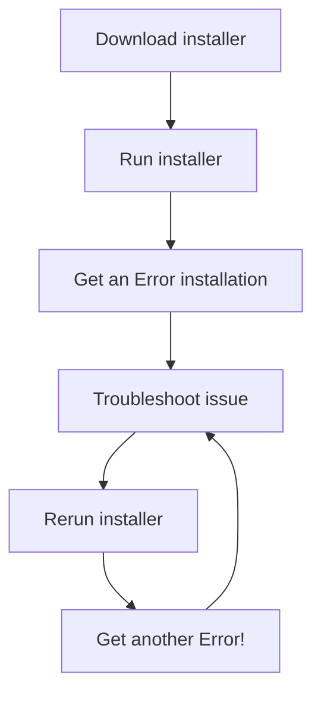

In this article, we'll explore Docker, its role in software development, and why
it's widely used. We'll break down the concept of images and their relationship
to containers. Additionally, we'll walk through the process of creating and
running a simple Docker container.

# Dive into Docker

## What and Why Docker?

The following diagram shows a typical installation process for a software
package.

