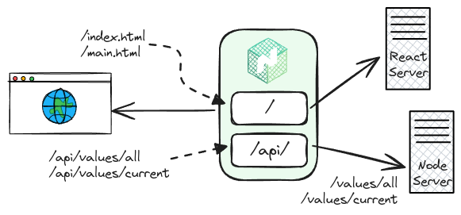

# Fibonacci - Calculate your Favorite Fibonacci Number

## Overview

The **Fibonacci** application is a _multi-container architecture_ comprising multiple services, each tailored for a specific purpose. Every service is organized with its own dedicated Dockerfile(s) located within its respective subdirectory. The entire system is seamlessly orchestrated using a central `docker-compose` file.

### Application Overview

| Fibonacci Sequence                                  | Client Mockup                           |
| --------------------------------------------------- | --------------------------------------- |
|  |  |

### Architecture Diagram


#### Nginx Path Routing



## Usage Instructions

### Development

Follow these steps to build the Docker images and launch the containers for development:

```bash

cd apps/fibonacci       # Navigate to the appropriate directory
docker compose up -d    # Start the application in detached mode

docker compose down -v  # Stop the application, and remove associated volumes
```

#### Running Tests

To execute unit tests of the Client within a Docker container , run the following command:

```bash
docker run --rm -it \
  -v $(pwd)/client:/usr/app \
  --name fib-client-test \
  fibonacci-client:latest \
  npm run test
```
