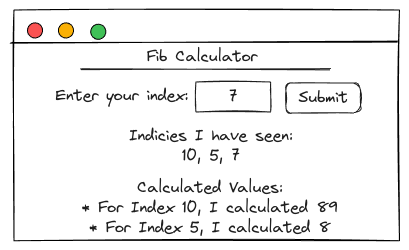
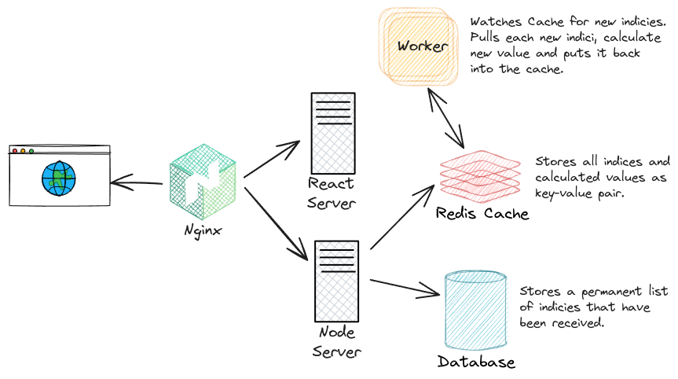

# Fibonacci - Calculate your Favorite Fibonacci Number

## Overview

The **Fibonacci** application is a _multi-container setup_ consisting of several services. Docker configuration files are located in the [`/docker`](/docker/) directory, with related files prefixed by _"Fib"_ (e.g. `FibClient.Dockerfile.dev`). The application's source code resides in the [`/apps/fibonacci`](/apps/fibonacci/) directory.

### Application Overview

| Fibonacci Sequence                                  | Client Mockup                           |
| --------------------------------------------------- | --------------------------------------- |
|  |  |

### Architecture Diagram



## Usage Instructions

### Development

To build the Docker Image and launch the Container for development, run the following commands:

```bash
# Build the Image and Start the Container
docker build -f ./docker/FibClient.Dockerfile.dev -t thomascode92/fib-client:dev --progress=plain ./apps/fibonacci/client/
docker build -f ./docker/FibServer.Dockerfile.dev -t thomascode92/fib-server:dev --progress=plain ./apps/fibonacci/server/
docker build -f ./docker/FibWorker.Dockerfile.dev -t thomascode92/fib-worker:dev --progress=plain ./apps/fibonacci/worker/

docker run -p 3000:5173 -v $(pwd)/apps/fibonacci/client:/usr/app -v /usr/app/node_modules thomascode92/fib-client:dev

# Use Docker Compose
docker compose -f docker/FibApp.docker-compose.yml up
```

The volumes mounts the client app code directory, enabling real-time syncing of code changes without needing to rebuild the image. It also isolates the container’s `node_modules` from the local environment, ensuring consistency and preventing conflicts. Visit the application on [localhost:3000](http://localhost:3000/).

### Running Tests

To execute unit tests within the Docker container for the _fibonacci client_ service, follow the steps below. Two options are available: running tests without live updates for quick checks or with live updates for continuous development.

<details>
<summary>Steps to run the unit tests</summary>

#### 1. Building the Docker Image

Begin by building the Docker image for the _fibonacci client_ application. This step creates a reusable development image. If the image already exists, building may be skipped.

```bash
docker build -f ./docker/FibClient.Dockerfile.dev -t thomascode92/fib-client:dev --progress=plain ./apps/fibonacci/client/
```

#### 2. Running Unit Tests

Choose between the following options based on development needs: **without live updates** (for single test runs) and **with live updates** (for continuous feedback as code is edited).

##### Option A: Running Tests without Live Updates

This command runs the tests once, which is suitable for quick test checks.

```bash
docker run -it thomascode92/fib-client:dev npm run test
```

##### Option B: Running Tests with Live Updates

For live testing with automatic updates as code changes, start the service in an interactive mode using Docker Compose.

```bash
docker compose -f docker/FibApp.docker-compose.yml up
docker exec -it <CONTAINER_ID> npm run test
```

Note: Replace `<CONTAINER_ID>` with the actual ID of the running web container. This command enables continuous test results, supporting a test-driven development workflow.

</details>

### Production

To build the Docker image and launch the containers for production, use the following commands:

```bash
docker build -f ./docker/FibClient.Dockerfile.prod -t thomascode92/fib-client --progress=plain ./apps/fibonacci/client/
docker run -p 8080:80 thomascode92/fib-client
```

TThe application will be served by Nginx and is accessible at [localhost:8080](http://localhost:8080/).
