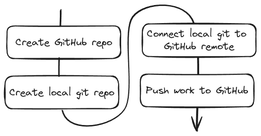
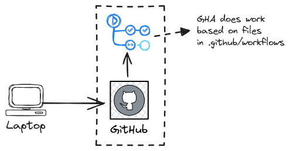
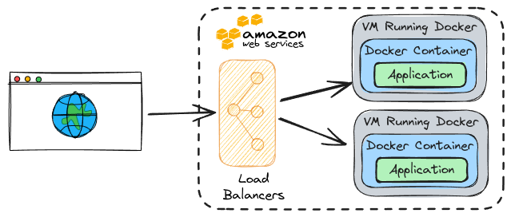

# Continuous Integration and Deployment with AWS

## Services Overview

- **GitHub** - Free!
- **GitHub Actions** Free!
- **AWS** - Free, but credit card required!

## GitHub Setup



### GitHub Actions

GitHub Actions uses YAML files to define workflows, which are automated sequences that execute one or more jobs. Each job consists of steps that run on the same runner, a virtual machine. These steps can execute commands, perform setup tasks, or run specific actions. GitHub Actions is built around four key concepts: triggers (when to run), jobs (what to do), steps (how to do it), and actions (reusable units of code).

#### Folder Structure

```bash
  project-root/
  ├── .github/
  │   └── workflows/
  │       └── main.yml
  └── (rest of your project files)
```

#### GitHub Actions Flow



## AWS Environment

**AWS Elastic Beanstalk** simplifies the deployment of Dockerized applications by managing infrastructure, scaling, and updates. Single or multi-container Docker environments can be deployed using a `Dockerfile` or `docker-compose.yml`. The service automates the provisioning of resources such as _EC2 instances_, _load balancers_, and auto-scaling groups.


