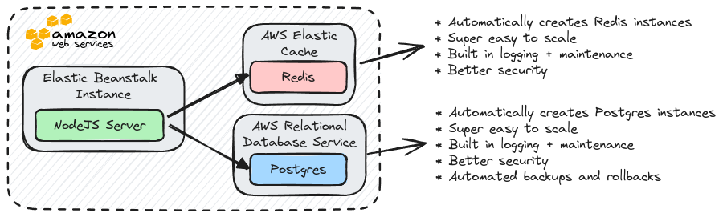

# Multi-Container Deployments to AWS

Please refer to the [`AWS Deployment`](./aws-deployment.md) documentation as well.

## Managed Data Service Providers

_Managed Data Services_ provide exceptional reliability and scalability, ensuring systems remain highly available and capable of handling growing data demands. Infrastructure management is handled by experts, allowing development teams to concentrate on delivering core business value without operational distractions. These services also offer strong security measures, regular updates, and compliance with industry standards, reducing risks and safeguarding data effectively.

