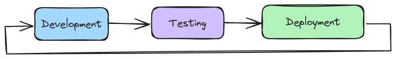
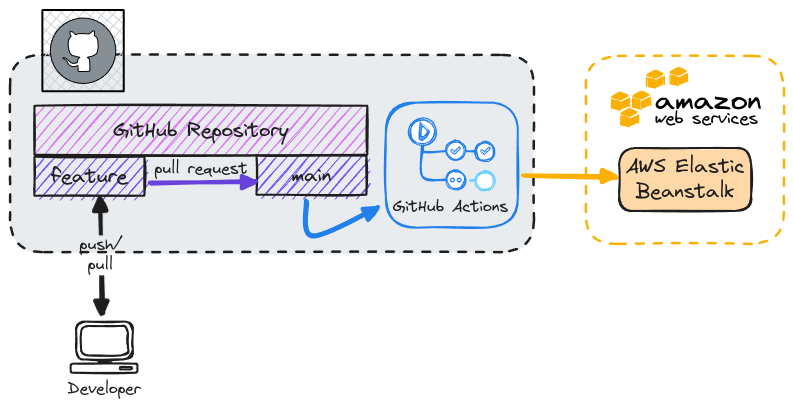

# Creating Production-Grade Workflows

## Development Workflow

### Flow Specifics

### Docker's Purpose

- The Flow Diagram didn't mention anything about Docker!
- Docker is a **tool** in a normal development flow.
- Docker makes some of these tasks a lot easier.
