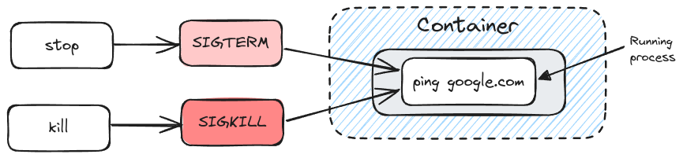
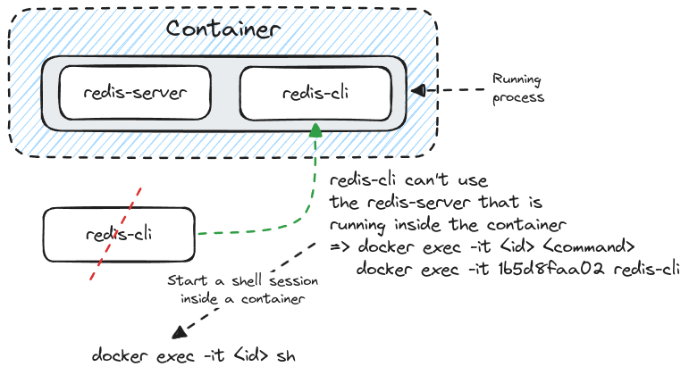
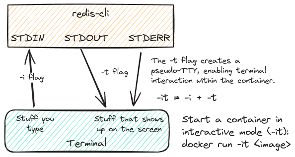

# Manipulating Containers with the Docker Client

## Running a Container

`docker run hello-world`

**Overriding Default Commands**: 
`docker run busybox echo hi there` 
`docker run busybox ls`

`docker run hello-world ls` => Will throw an error!

## Container Management

- **List Containers** - `docker ps`, logs all running containers
- **List all Containers** - `docker ps --all`, logs all running and stopped containers
- **Create Container** - `docker create <image>`, create a container
- **Start Container** - `docker start -a <container_id>`, start (or restart) a container
- **Run Container** - `docker run <image>`, create and start a container
- **Stop Container** - `docker stop <container_id>`, stop a container
- **Kill Container** - `docker kill <container_id>`, kill a container
- **Delete Container** - `docker container rm <container_id>`, delete a container
- **Clear all** - `docker system prune`, delete all unused data
- **View Logs** - `docker logs <container_id>`, printout the logs of a container

### Docker Stop vs Docker Kill

## Multi-Command Containers

### The _-it_ flag

