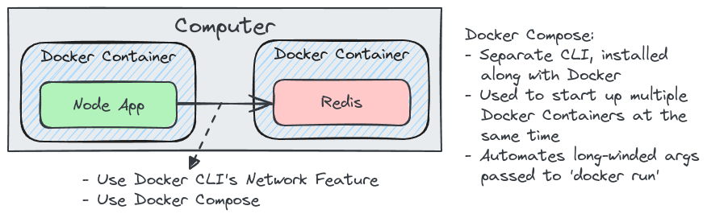

# Docker Compose with Multiple Local Containers

## Multi Container Apps

## Docker Compose

Docker Compose simplifies the orchestration of _multi-container_ Docker applications by defining and running services through a single `docker-compose.yml` file. Each container's image and configuration are specified, streamlining the setup of complex environments. It's ideal for development, testing, and deployment of applications requiring multiple interconnected services.

### Docker Compose Commands

- **Start Containers** - `docker compose up`
  - at `--build` flag to build the image first
  - at `-d` flag to launch in the background
- **Stop Containers** - `docker compose down`

### Restart Policies

- **_"no"_** - Never attempt to restart the container if it stops or crashes.
- **_"always"_** - If the container stops "for any reason" always attempt to restart it.
- **_"on-failure"_** - Only restart if the container stops with an error code.
- **_"unless-stopped"_** - Always restart unless it is forcibly stopped.
