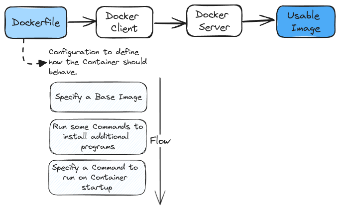

# Building Custom Images through Docker Server

## Creating Docker Images

At the root level of this project, there is a _`docker`_ folder containing a _`Redis.Dockerfile`_. To create an image, run the following command from the root directory: 
`docker build -f ./docker/Redis.Dockerfile .`.
