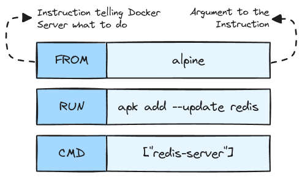

# Building Custom Images through Docker Server

## Creating Docker Images


At the root level of this project, there is a _`docker`_ folder containing a _`Redis.Dockerfile`_. To create an image, run the following command from the root directory:<br />
`docker build -f ./docker/Redis.Dockerfile .`.

### Dockerfile Teardown



## Caching and Tagging

### Caching

Each step in a Dockerfile creates a layer, and if the content of a layer is unchanged, Docker pulls it from the cache instead of rebuilding it. Efficiently ordering commands in the Dockerfile can maximize cache use and speed up subsequent builds.

### Tagging

Tagging Docker images assigns meaningful names and versions to images for easy identification. Tags, such as `latest` or version numbers, help distinguish different versions of the same image. This allows for efficient management when pushing or pulling specific builds from a registry.<br />
E.g.: `docker build -f ./docker/Redis.Dockerfile -t my_redis:latest .`

## Manual Image Generation

Manual image generation involves running a container, making changes (e.g., installing software), and committing those changes to create a new image.
This process uses the `docker commit` command to save the modified container as a reusable image.

```bash
  docker run -it alpine sh
    ## inside the container, run:
    apk add --update redis

  # open a new terminal
  docker ps --all # copy id of alpine container
  docker commit -c 'CMD ["redis-server"]' <ID> # copy id
  docker run <ID>
```
