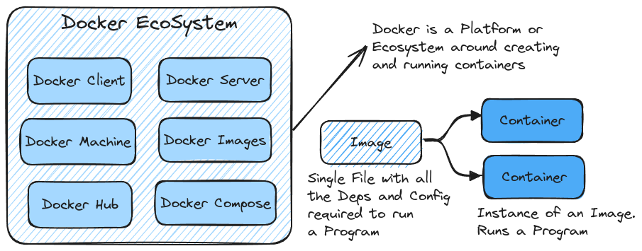
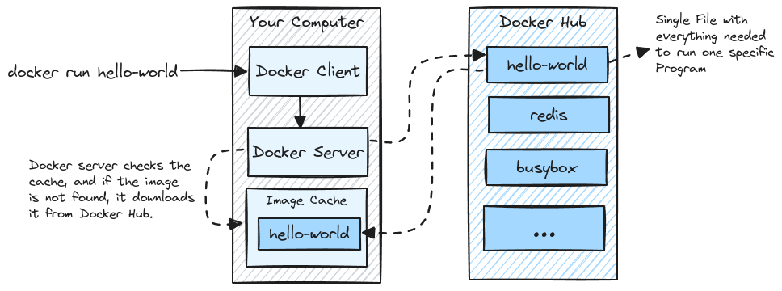
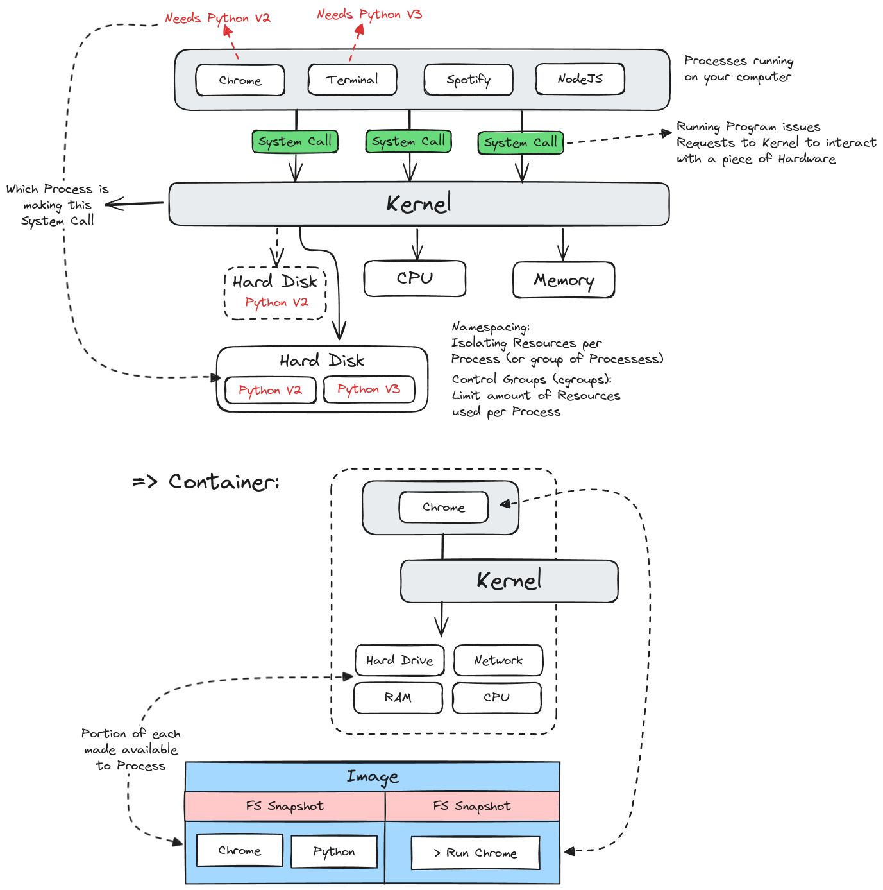
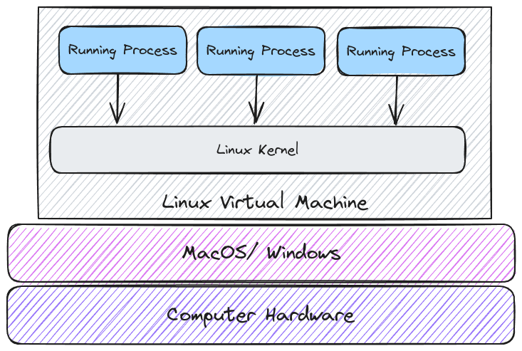

# Dive Into Docker

## Docker - What and Why?

### Why Use Docker

### What is Docker

## Using the Docker Client

**Basic Command:** `docker run hello-world`

## Containers

### Linux Virtual Machine

The _Namespaces_ and _Control Group_ features are unique to the Linux operating system. To support these, Docker utilizes a _Linux Virtual Machine_. To identify the operating system used for this virtual machine, check the `OS/Arch` field after running the `docker version` command.

